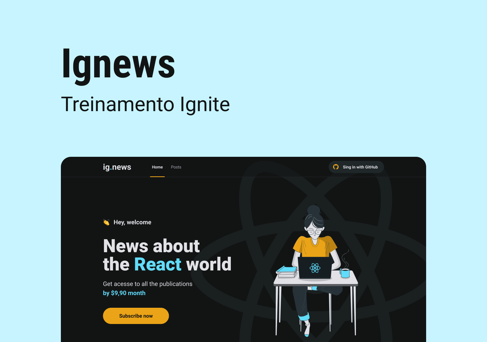

# ig.news

A JAMStack application of a news page developed at [Rocketseat's](https://www.rocketseat.com.br/) _Ignite ReactJS_ course using ReactJS and NextJS. Also was used the Stripe API for payment and subscription management, FaunaDB as database and Prismic as Headless CMS.



# Getting Started

On terminal, clone de repository and go to the directory
```bash
clone https://github.com/igoormichaeel/ignews.git
cd ignews
```
And execute the following command to install all de dependencies:

```bash
yarn
```

Then, to runs the app in the development mode, execute:

```bash
yarn dev
```

Open [http://localhost:3000](http://localhost:3000) to view it in the browser.

The page will reload if you make edits.\
You will also see any lint errors in the console.
